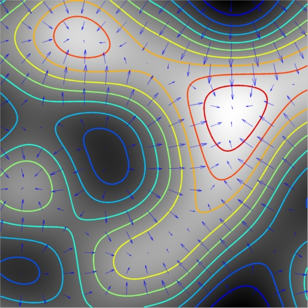

**matlabnoise - Matlab noise library**
---------
---------


**Overview**
--------

This is just a mex wrapper around a C++ port of Brian Sharpe's GPU-Noise-Lib: https://github.com/BrianSharpe/GPU-Noise-Lib (Thanks Brian for putting together such an awesome GLSL library!).

Not everything from the above library has been ported and implemented. ```noise_common.cpp``` contains the GLSL port.

Note that I did not attempt to optimize the code here in any way.  In fact, because of the generous use of copy constructors I am relying quite heavily on the optimizing compiler here.  Still, it's significantly faster than the same code in Matlab (even when properly vectorized).

The following functions from Brian's work have been exposed:
- Perlin2D
- Perlin3D
- Perlin4D
- Perlin2DDeriv
- Perlin3DDeriv
- Hermite2D
- Hermite3D
- Hermite2DDeriv
- Hermite3DDeriv

Clearly, I'm just using it as a fast Perlin noise implementation in Matlab.  However, given that I have already written the vec2, vec3 and vec4 classes it will be quick work porting more functions from GPU-Noise-Lib.

**Compilation**
---------------

Run "compile_mex.m".

**Running**
---------------

Run "test_mex.m" for a usage demo.
